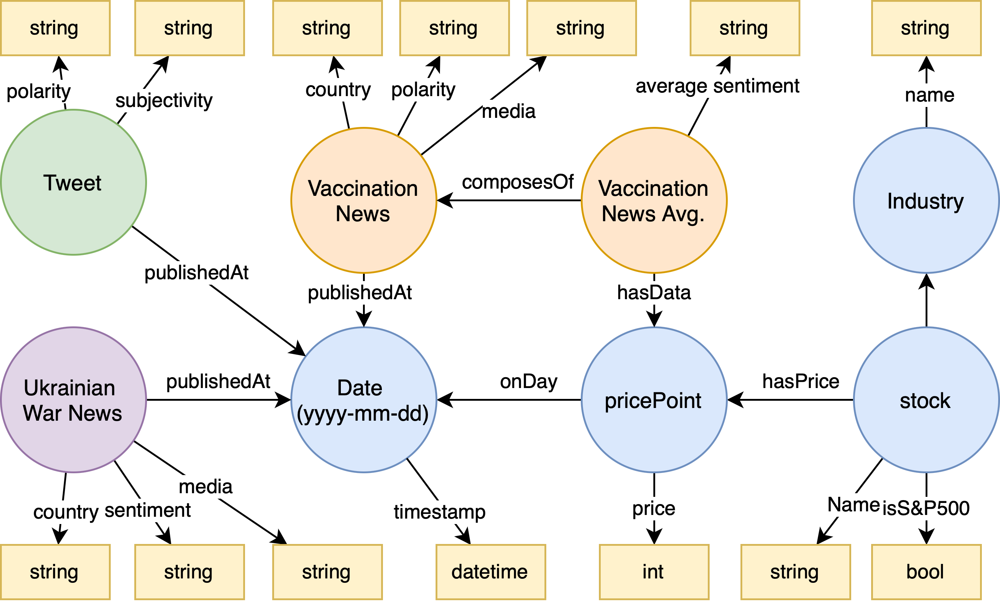
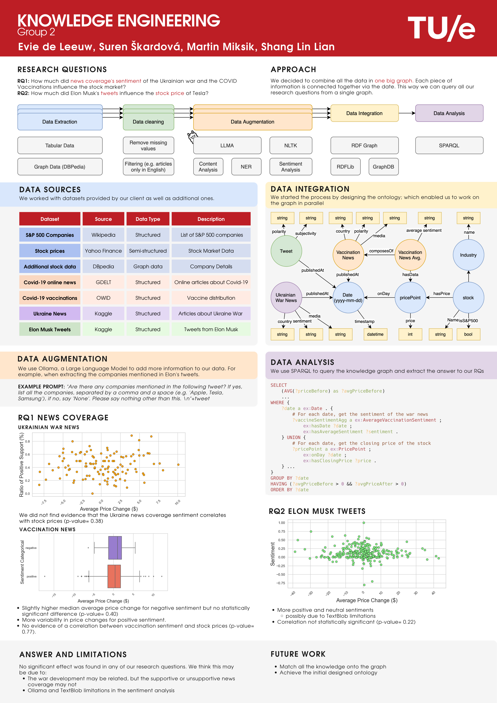

As part of knowledge engineering course at the University of Eindhoven, we were tasked with answering following reseach questions:
- RQ1: How much did news coverage's sentiment of the Ukrainian war and the COVID Vaccinations influence the stock market?
- RQ2: How much did Elon Musk's tweets influence the stock price of Tesla?

This is a repository containing scripts for fetching, processing data, and integrating the data into knowledge graph. The knowledge graph was then used to answer the research questions.

# How to use
1. Create a virtual environment
2. Install the required packages `pip install -r requirements.txt`
3. Run the script `python main.py`

- This command will give you options to run different scripts (e.g. script for fetching stock information)
- To run the script for fetching stock information, run `python main.py stock-data-to-ttl`

# How to add new component
1. Create a new python file in the `lib` directory
2. Add all necessary functions in the file
3. Create one function that will be called from the main script (`import_sp_stock_data` in this case). The function most likely should accept some parameters like graph instance
4. Add new function to the main script (`main.py`) and call the function created in step 3, passing necessary parameters and possible saving the result to file. Make sure the function is decorated with `@cli_app.command()`
5. Use click to add optional parameters to the function

**We welcome contributions to this repository. If you have any questions, feel free to open an issue.**

# Components requiring heavy preprocessing computation
For components that require heavy preprocessing computation, such as sentiment analysis using large language models, it's recomended to handle the preprocessing in a separate notebook or script and save the result to a file. 
The main script should then load the file and perform the remaining operations. This will save time and resources. 

# Working with the graph data
The graph data can be queried using SPARQL queries, which can be executed using the `rdflib` library. However, we recommend using a graph database for better performance (see Graphdb: https://graphdb.ontotext.com)

# Queries
The queries used to answer the research questions are in the `queries` directory, the output (timeseries) was used to perform the statistical analysis.

# Ontology

# Poster

